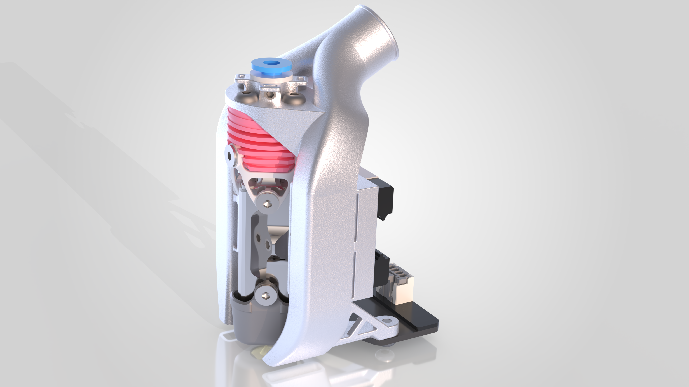
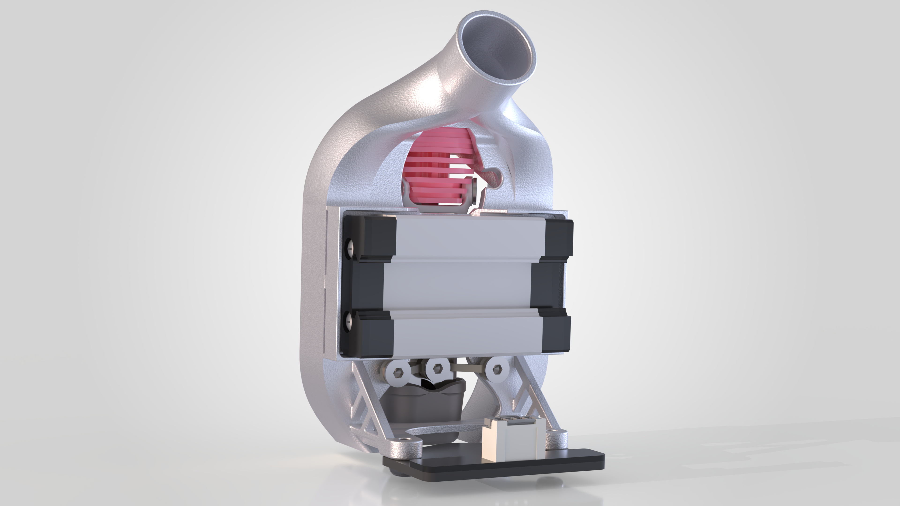

# Microwaved Bowden Toolhead

This is an SLM toolhead designed for the Tricorn hotend.

**THIS IS STILL A WIP AND HAS NOT BEEN TESTED YET**

## Features

- Bowden extrusion (Boombox)
- Mounting points for Colphaer’s Kevlar sheathing system
- Bottom hotend bracing
- CPAP cooling
- Pull-through belt routing
- Lightweight (~100g)

## Requirements

- Tricorn hotend
- Monolith SLM belt clamp
- Beacon H probe
- 15mm CPAP tube
- ECAS fitting (4mm tube)
- Monolith belt spacing
- Bowden extruder (Boombox is best)
- Colphaer's kevlar sheath to keep the
  bowden tube from stretching (optional)
- 2× M3 × 2.5mm set screws  
- 3× M3 × 6mm BHCS  
- 4× M3 × 8mm BHCS  
- 3× M3 × 4mm FHCS *(preferably titanium)*  

## Material Choice

### Main Body
Ideally manufactured from **aluminium**.

Since there is no hotend fan, maximizing heat conduction away from the heatsink is important
to avoid heat creep.

### Hotend Brace (optional)
Should be made from **titanium** to minimise heat transfer between the hotend and the main body.
Using **titanium screws** for the brace further reduces thermal conduction.

## Acknowledgements

Thanks to:

CloakedWayne for his SLM belt clamp

Colphaer for his boombox, kevlar sheathing 
and advice on bowden fittings

Solar and Diode King for test fitting
and feedback 

Anyone else who gave advice 
along the way.
